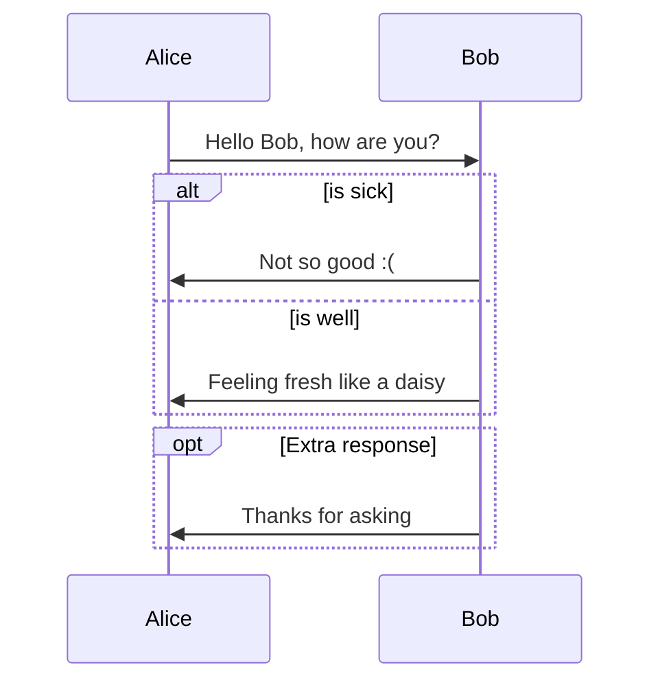
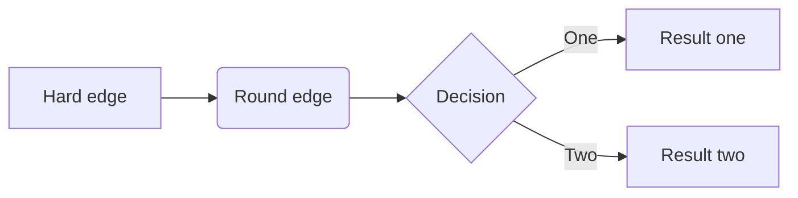

---

---

# Example for OneDark Theme

[toc]

## Headers

### h3

Markdown is a lightweight markup language with plain-text-formatting syntax. Its design allows it to be converted to many output formats, but the original tool by the same name only supports HTML. Markdown is often used to format readme files, for writing messages in online discussion forums, and to create rich text using a plain text editor.

#### h4

Since the initial description of Markdown contained ambiguities and unanswered questions, the implementations that appeared over the years have subtle differences and many come with syntax extensions.

##### h5

In MediaWiki, it is implemented in the currently unmaintained MarkdownExtraParser parser function extension

###### h6

Implementations of Markdown are available for over a dozen programming languages.

## Quote

> Most UI components including tooltip, dialog and buttons are painted by HTML. And you only need to change those part when you find the UI components are incompatible with your editor theme after finishing steps above. HTML files from the toolkit includes most common UI components for you to easily debug.

## Font Style

**Bold**, *italic*, ~~delete~~

<u>underline</u>, [Link](typora.io)

H~2~O, E=mc^2^

<span style="color:red">colored text</span>, ==highlight==

emoji: :smile:

- [ ] checkbox

## Codeblock

```python
# hello_world.py
class HelloWorld():
	def __init__(self):
        self.text='hello world!'
    
    def show(self,word):
        print(f'{word}, {self.text}')
        
test=HelloWorld()
test.show()
```

Run terminal then enter: `python hello_world.py`

## MathJax

Given two populations, $x_1$ and $x_2$ , with logistic dynamics, the Lotka–Volterra formulation adds an additional term to account for the species' interactions. Thus the competitive Lotka–Volterra equations are:
$$
\begin{cases}
\cfrac{dx_1}{dt}=r_1x_1\bigg(1-\cfrac{x_1+\alpha_{12} x_2}{K_1}\bigg)\\ 
\cfrac{dx_2}{dt}=r_2x_2\bigg(1-\cfrac{x_2+\alpha_{21} x_1}{K_2}\bigg)
\end{cases}
$$
Here, $\alpha_{12}$ represents the effect species 2 has on the population of species 1 and  $\alpha_{21}$represents the effect species 1 has on the population of species 2. 

## Order

1. first item
2. second item
   1. first item
   2. second item
3. third item

---

* first item
* second item
  * first item
    * first item
* fourth item

## Table

| Cinderella   |   11 | glass       | transparent |
| :----------- | ---: | :---------- | :---------- |
| Name         | Size | Material    | Color       |
| All Business |    9 | leather     | brown       |
| Roundabout   |   10 | hemp canvas | natural     |

## Footnote

You can create footnotes like this[^fn1] and this[^fn2]. 

[^fn1]: Here is the **text** of the first ***\*footnote\****. 
[^fn2]: Here is the **text** of the second ***\*footnote\****.

## Image, Video


<video src="./video.mp4" />

## Graph

### sequence

```sequence
Alice->Bob: Hello Bob, how are you?
Note right of Bob: Bob thinks
Bob-->Alice: I am good thanks!
```

### flow

```flow
st=>start: Start
op=>operation: Your Operation
cond=>condition: Yes or No?
e=>end

st->op->cond
cond(yes)->e
cond(no)->op
```

### mermaid

#### sequence



#### flowchart



#### gantt

